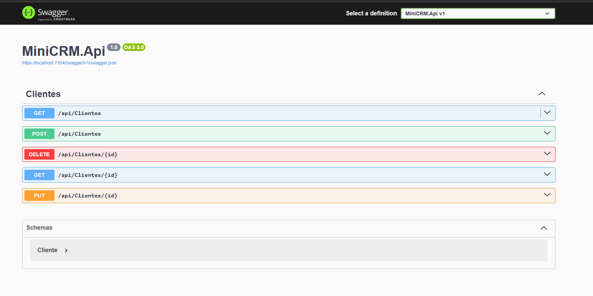

# MiniCRM API

Web API desarrollada en **C# con ASP.NET Core y SQLite**, orientada a la gestión de clientes con una lógica tipo CRM.

Este proyecto forma parte de mi portfolio backend, enfocado en demostrar diseño de APIs REST, persistencia de datos, separación por capas y documentación de endpoints.

---

##  Funcionalidades actuales

- Obtener todos los clientes
- Obtener cliente por Id
- Crear cliente
- Actualizar cliente
- Persistencia con SQLite
- Pruebas y documentación con Swagger

---

##  Tecnologías utilizadas

- C#
- ASP.NET Core Web API
- SQLite
- Microsoft.Data.Sqlite
- Swagger / OpenAPI

---

##  Estructura del proyecto

- **Models** → representa las entidades del sistema
- **Data** → acceso a base de datos SQLite
- **Controllers** → endpoints de la API
- **Program.cs** → configuración general y arranque

---

##  Estado actual

Actualmente la API permite realizar operaciones CRUD sobre clientes desde Swagger, conectando con una base SQLite local y manteniendo una estructura organizada por responsabilidades.

---

##  Próximos pasos

- Eliminar clientes
- Mejorar validaciones
- Incorporar capa de Services
- DTOs para intercambio de datos
- Manejo global de errores
- Evolución hacia arquitectura más profesional
- Deploy online de la API

---

##  Cómo ejecutar el proyecto

1. Clonar el repositorio
2. Abrir la solución en Visual Studio
3. Restaurar paquetes NuGet
4. Ejecutar el proyecto
5. Probar endpoints desde Swagger
